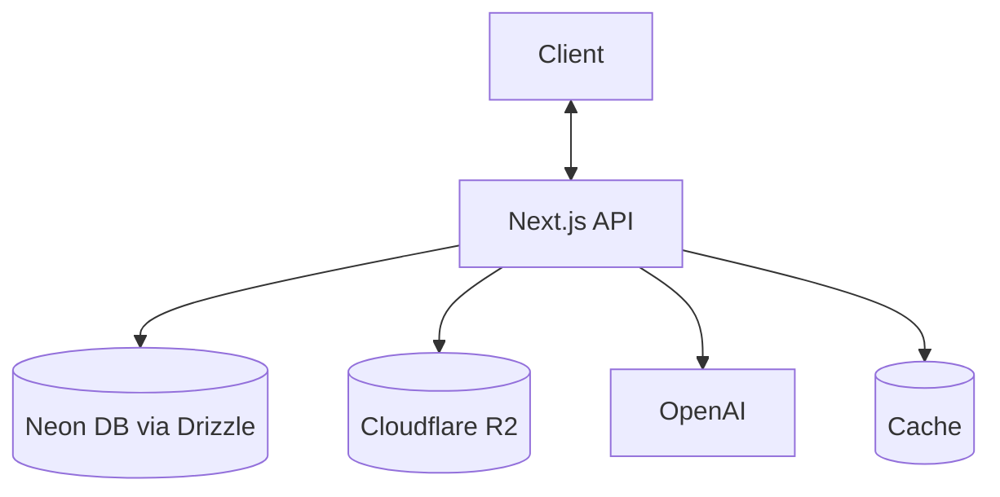
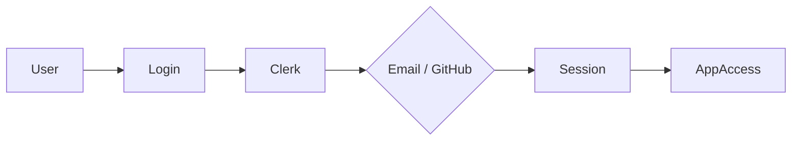
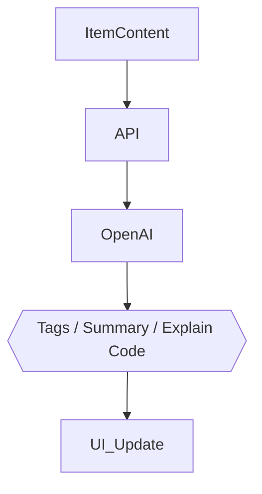

## PixelMind — Project Specifications

🚀 **Centralized Developer Knowledge Hub** for code snippets, AI prompts, docs, commands & more.

---

## 📌 Problem (Core Idea)

Developers keep their essentials scattered:

- Code snippets in VS Code or Notion
- AI prompts in chats
- Context files buried in projects
- Useful links in bookmarks
- Docs in random folders
- Commands in `.txt` files
- Project templates in GitHub gists
- Terminal commands in bash history

This creates **context switching, lost knowledge**, and **inconsistent workflows**.

➡️ **PixelMind provides ONE searchable, AI‑enhanced hub for all dev knowledge & resources.**

---

## 🧑‍💻 Users

| Persona                    | Needs                                     |
| --------------------------- | ------------------------------------------ |
| Everyday Developer          | Quick access to snippets, commands, links |
| AI‑First Developer          | Store prompts, workflows, contexts        |
| Content Creator / Educator  | Save course notes, reusable code          |
| Full‑Stack Builder          | Patterns, boilerplates, API references    |

---

## ✨ Core Features

### A) Items & System Item Types

Items can belong to one of the following built‑in types:

- 📝 Snippet
- 💬 Prompt
- 🗒️ Note
- ⌘ Command
- 📄 File
- 🖼️ Image
- 🔗 URL

Custom types allowed for Pro users.

### B) Collections

Organize items — mixed item types allowed.

Examples: React Patterns · Context Files · Python Snippets

### C) Search

Full‑text search across:

- Content
- Tags
- Titles
- Types

### D) Authentication

- Email + Password
- GitHub OAuth

### E) Additional Features

- ⭐ Favorites & pinned items
- 🕓 Recently used
- 📥 Import from files
- ✍️ Markdown editor for text items
- 📎 File uploads (images, docs, templates)
- 📤 Export (JSON / ZIP)
- 🌙 Dark mode (default)

### F) AI Superpowers

- 🏷️ Auto‑tagging
- 📋 AI summaries
- 🧩 Explain Code
- ⚡ Prompt optimization

> AI powered by **OpenAI gpt-5-nano**

---

## 🗄️ Data Model — Drizzle ORM Schema

> Starting point — **will evolve**. Postgres via Neon, IDs generated with `@paralleldrive/cuid2`.

```typescript
// schema.ts
import { pgTable, text, boolean, integer, timestamp, primaryKey } from "drizzle-orm/pg-core";
import { relations } from "drizzle-orm";
import { createId } from "@paralleldrive/cuid2";

export const users = pgTable("user", {
  id: text("id").primaryKey().$defaultFn(() => createId()),
  email: text("email").notNull().unique(),
  password: text("password"),
  isPro: boolean("is_pro").notNull().default(false),
  stripeCustomerId: text("stripe_customer_id"),
  stripeSubscriptionId: text("stripe_subscription_id"),
  createdAt: timestamp("created_at").notNull().defaultNow(),
  updatedAt: timestamp("updated_at").notNull().defaultNow().$onUpdate(() => new Date()),
});

export const itemTypes = pgTable("item_type", {
  id: text("id").primaryKey().$defaultFn(() => createId()),
  name: text("name").notNull(),
  icon: text("icon"),
  color: text("color"),
  isSystem: boolean("is_system").notNull().default(false),
  userId: text("user_id").references(() => users.id),
});

export const collections = pgTable("collection", {
  id: text("id").primaryKey().$defaultFn(() => createId()),
  name: text("name").notNull(),
  description: text("description"),
  isFavorite: boolean("is_favorite").notNull().default(false),
  userId: text("user_id").notNull().references(() => users.id),
  createdAt: timestamp("created_at").notNull().defaultNow(),
  updatedAt: timestamp("updated_at").notNull().defaultNow().$onUpdate(() => new Date()),
});

export const items = pgTable("item", {
  id: text("id").primaryKey().$defaultFn(() => createId()),
  title: text("title").notNull(),
  contentType: text("content_type").notNull(), // "text" | "file"
  content: text("content"),
  fileUrl: text("file_url"),
  fileName: text("file_name"),
  fileSize: integer("file_size"),
  url: text("url"),
  description: text("description"),
  isFavorite: boolean("is_favorite").notNull().default(false),
  isPinned: boolean("is_pinned").notNull().default(false),
  language: text("language"),
  userId: text("user_id").notNull().references(() => users.id),
  typeId: text("type_id").notNull().references(() => itemTypes.id),
  collectionId: text("collection_id").references(() => collections.id),
  createdAt: timestamp("created_at").notNull().defaultNow(),
  updatedAt: timestamp("updated_at").notNull().defaultNow().$onUpdate(() => new Date()),
});

export const tags = pgTable("tag", {
  id: text("id").primaryKey().$defaultFn(() => createId()),
  name: text("name").notNull(),
  userId: text("user_id").notNull().references(() => users.id),
});

export const itemTags = pgTable(
  "item_tag",
  {
    itemId: text("item_id").notNull().references(() => items.id),
    tagId: text("tag_id").notNull().references(() => tags.id),
  },
  (table) => ({
    pk: primaryKey({ columns: [table.itemId, table.tagId] }),
  })
);

// --- Relations ---

export const usersRelations = relations(users, ({ many }) => ({
  items: many(items),
  itemTypes: many(itemTypes),
  collections: many(collections),
  tags: many(tags),
}));

export const itemsRelations = relations(items, ({ one, many }) => ({
  user: one(users, { fields: [items.userId], references: [users.id] }),
  type: one(itemTypes, { fields: [items.typeId], references: [itemTypes.id] }),
  collection: one(collections, { fields: [items.collectionId], references: [collections.id] }),
  tags: many(itemTags),
}));

export const itemTypesRelations = relations(itemTypes, ({ one, many }) => ({
  user: one(users, { fields: [itemTypes.userId], references: [users.id] }),
  items: many(items),
}));

export const collectionsRelations = relations(collections, ({ one, many }) => ({
  user: one(users, { fields: [collections.userId], references: [users.id] }),
  items: many(items),
}));

export const tagsRelations = relations(tags, ({ one, many }) => ({
  user: one(users, { fields: [tags.userId], references: [users.id] }),
  items: many(itemTags),
}));

export const itemTagsRelations = relations(itemTags, ({ one }) => ({
  item: one(items, { fields: [itemTags.itemId], references: [items.id] }),
  tag: one(tags, { fields: [itemTags.tagId], references: [tags.id] }),
}));
```

---

## 🧱 Tech Stack

| Category     | Choice                          |
| ------------ | -------------------------------- |
| Framework    | **Next.js (React 19)**           |
| Language     | TypeScript                       |
| Database     | Neon PostgreSQL + Drizzle ORM    |
| Caching      | Redis (optional)                 |
| File Storage | Cloudflare R2                    |
| CSS/UI       | Tailwind CSS v4 + ShadCN         |
| Auth         | Clerk (email + GitHub)           |
| AI           | OpenAI gpt-5-nano                |
| Deployment   | Hostinger VPS                    |
| Monitoring   | Sentry (later)                   |

---

## 💰 Monetization

| Plan | Price            | Limits                   | Features                                          |
| ---- | ---------------- | ------------------------- | -------------------------------------------------- |
| Free | $0                | 50 items, 3 collections   | Basic search, image uploads, no AI                |
| Pro  | $8/mo or $72/yr   | Unlimited                 | File uploads, custom types, AI features, export   |

> Stripe for subscriptions + webhooks for syncing

---

## 🎨 UI / UX

- Dark mode first
- Minimal, developer‑friendly UI
- Syntax highlighting for code
- Inspired by **Notion, Linear, Raycast**

### Layout

- Collapsible sidebar with filters & collections
- Main grid/list workspace
- Full‑screen item editor

### Responsive

- Mobile drawer for sidebar
- Touch‑optimized icons and buttons

---

## 🔌 API Architecture



---

## 🔐 Auth Flow



---

## 🧠 AI Feature Flow



---

## 📁 Suggested Repo Structure

```
pixelmind/
├── app/
│   ├── (auth)/
│   ├── (dashboard)/
│   │   ├── items/
│   │   ├── collections/
│   │   └── settings/
│   └── api/
│       ├── items/
│       ├── ai/
│       └── stripe/
├── db/
│   ├── schema.ts
│   └── index.ts
├── lib/
│   ├── clerk.ts
│   ├── ai.ts
│   └── r2.ts
├── components/
└── drizzle.config.ts
```

## 🔑 Environment Variables (draft)

```
DATABASE_URL=
NEXT_PUBLIC_CLERK_PUBLISHABLE_KEY=
CLERK_SECRET_KEY=
CLERK_WEBHOOK_SECRET=
OPENAI_API_KEY=
R2_ACCESS_KEY_ID=
R2_SECRET_ACCESS_KEY=
R2_BUCKET_NAME=
STRIPE_SECRET_KEY=
STRIPE_WEBHOOK_SECRET=
REDIS_URL=
```

---

## 🗂️ Development Workflow (For Course)

- **One branch per lesson** (students can follow & compare)
- Use **Cursor / Claude Code / ChatGPT** for assistance
- Sentry for runtime monitoring & error tracking
- GitHub Actions (optional for CI)

**Branch example:**

```
git switch -c lesson-01-setup
```

---

## 🔗 Links & Reference

- [Drizzle ORM Docs](https://orm.drizzle.team/docs/overview)
- [Next.js Docs](https://nextjs.org/docs)
- [Clerk Docs](https://clerk.com/docs)
- [Cloudflare R2 Docs](https://developers.cloudflare.com/r2/)
- [Neon Postgres Docs](https://neon.tech/docs/introduction)
- [ShadCN UI](https://ui.shadcn.com)
- [Stripe Billing Docs](https://docs.stripe.com/billing)
- Inspiration: [Notion](https://notion.so) · [Linear](https://linear.app) · [Raycast](https://raycast.com)

---

## 🧭 Roadmap

### MVP

- Items CRUD
- Collections
- Search
- Basic tags
- Free tier limits

### Pro Phase

- AI features
- Custom item types
- File uploads
- Export
- Billing & upgrade flow

### Future Enhancements

- Shared collections
- Team/Org plans
- VS Code extension
- Browser extension
- API + CLI tool

---

## 📌 Status

- In planning
- Ready for environment setup & UI scaffolding

---

🏗️ **PixelMind — Store Smarter. Build Faster.**
